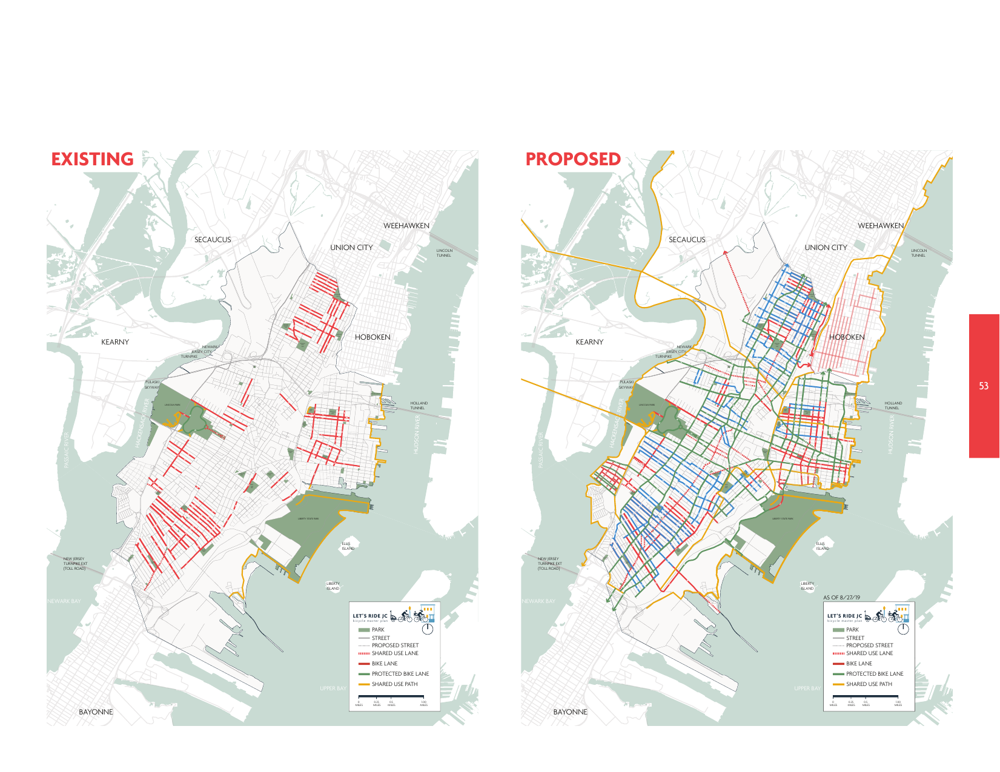

# Jersey City Bike Master Plan

Experiments in rendering the [the JC Bike Master Plan][JC Bike Master Plan PDF]:



- Individual slide images under [imgs/](imgs)
  - Link to a specific slide like: [github.com/bikejc/bike-master-plan/blob/main/imgs/bmp-053.png](https://github.com/bikejc/bike-master-plan/blob/main/imgs/bmp-053.png)
  - Not a good viewing experience, no browsing supported
- One big markdown file: [slides.md](slides.md)
  - Link to a specific slide like: [github.com/bikejc/bike-master-plan/blob/main/slides.md#pg-53](https://github.com/bikejc/bike-master-plan/blob/main/slides.md#pg-53)
  - Takes a long time to load page (≈100MB of images 😭)
- GitHub Pages: [bikejc.github.io/bike-master-plan](https://bikejc.github.io/bike-master-plan/)
  - [bikejc.github.io/bike-master-plan/slides.md#pg-53](https://bikejc.github.io/bike-master-plan/slides.md#pg-53) should also work
  - Same issue as above, page loads ≈100MB of images, takes a while, is huge.
 
Neither of these works very well, will hopefully have something better soon™.

### Scratch
Convert [`jc bike master plan.pdf`](jc%20bike%20master%20plan.pdf) to images:
```bash
pdftoppm "jc bike master plan.pdf" "imgs/bmp" -png
```

Make [`slides.md`](slides.md) (see [`make-slides.sh`](make-slides.sh))
```bash
(
    for i in `seq 1 168`; do
        d="$(printf "%03d" "$i")"
        echo -n "<a id=\"pg-${i}\"></a>"
        echo '![]'"(./imgs/bmp-${d}.png)"
    done
) > slides.md
```

[JC Bike Master Plan PDF]: https://cdn5-hosted.civiclive.com/UserFiles/Servers/Server_6189660/File/Community/Transportation/LetsRideJCMasterPlan-FinalDraft%206.16.19_09_30.pdf
