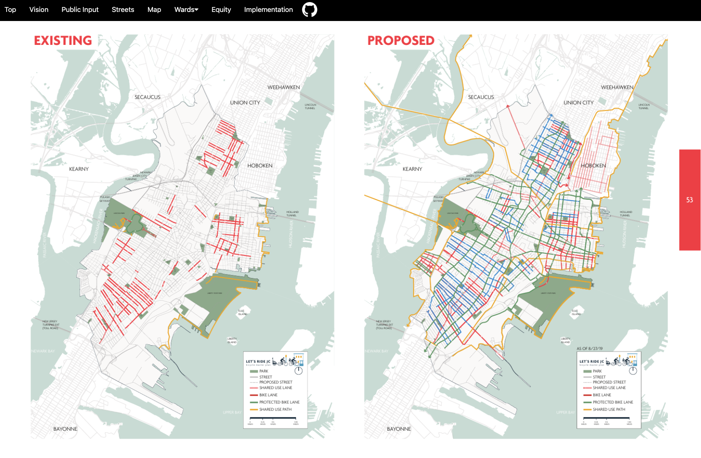

# Jersey City Bike Master Plan
Rendering the JC Bike Master Plan as a webpage: [bikejc.github.io/bike-master-plan](https://bikejc.github.io/bike-master-plan)

[The original PDF][JC Bike Master Plan PDF] is available from [the JC Dept of Infrastructure](https://www.jerseycitynj.gov/cityhall/infrastructure) (under "Plans"). It's ≈72MB, and a bit unwieldy to scroll through or deep-link into.

The web version above supports direct-linking to specific slides, e.g.:
- Proposed map: [bikejc.github.io/bike-master-plan#53](https://bikejc.github.io/bike-master-plan#53)
- Ward B detail: [bikejc.github.io/bike-master-plan#ward-b](https://bikejc.github.io/bike-master-plan#ward-b)

It also exposes a menu with direct links to various sections.



### Scratch
Convert [`jc bike master plan.pdf`](jc%20bike%20master%20plan.pdf) to images:
```bash
pdftoppm "jc bike master plan.pdf" "public/img/bmp" -png
```

[JC Bike Master Plan PDF]: https://cdn5-hosted.civiclive.com/UserFiles/Servers/Server_6189660/File/Community/Transportation/LetsRideJCMasterPlan-FinalDraft%206.16.19_09_30.pdf
